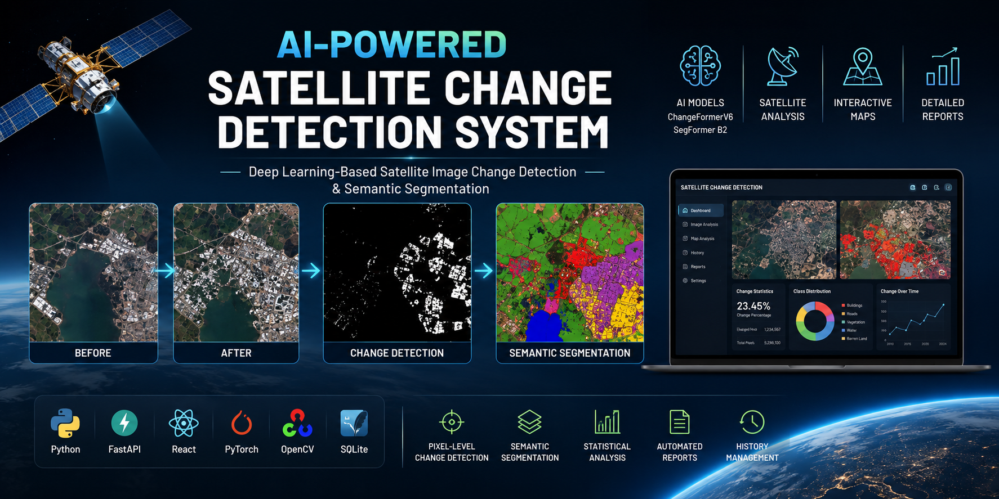
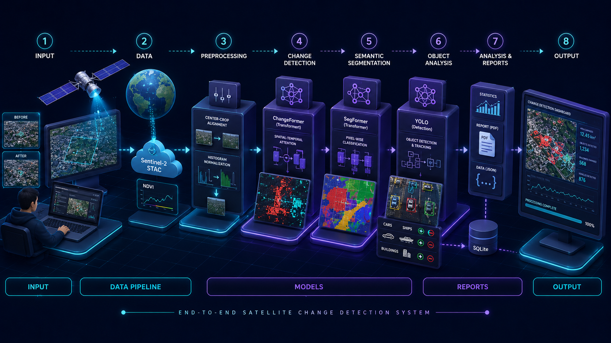
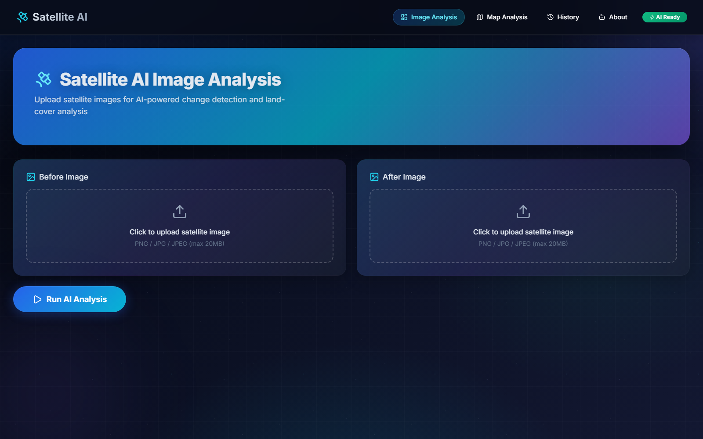
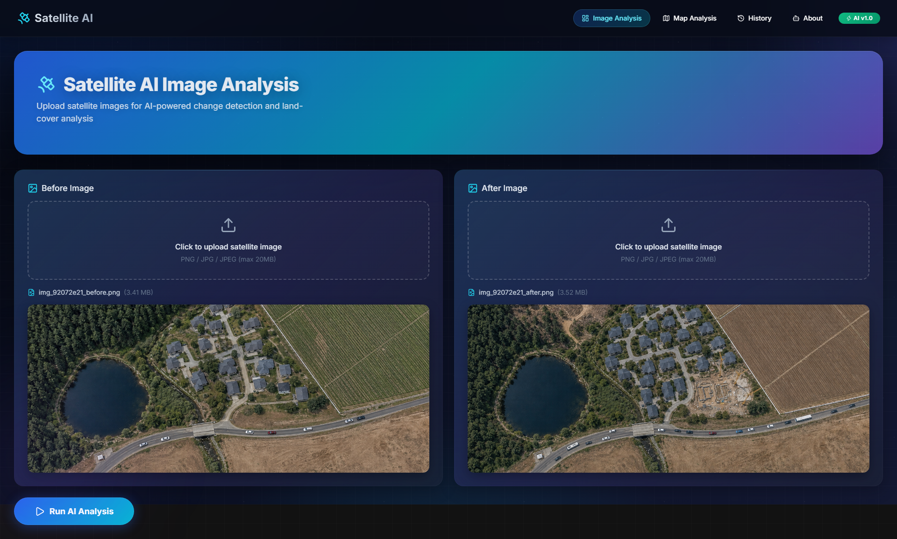
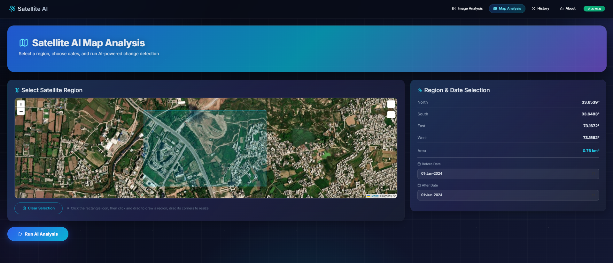
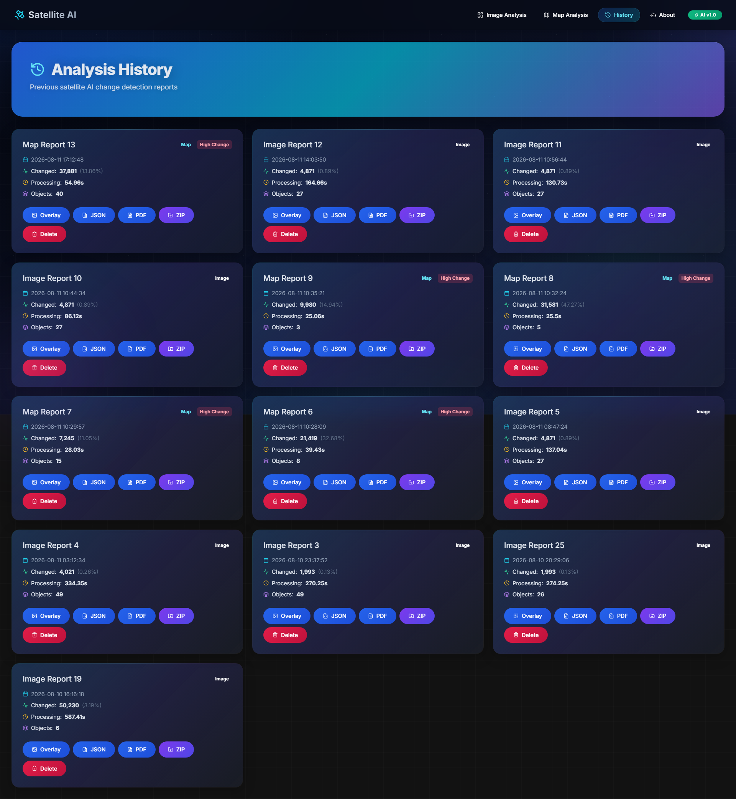

# 🚀 Satellite-Change-Detection — AI-Powered Satellite Change Detection System

<p align="center">
  
</p>


<h3 align="center">
ChangeFormer V6 Change Detection, LoveDA SegFormer B2 Land-Cover Segmentation & YOLO26-OBB Object Detection with an Interactive GIS Dashboard
</h3>


<p align="center">


</p>


---


A modern **AI-powered satellite analysis platform** built with **FastAPI**, **PyTorch**, **React**, and **React Leaflet**.


The platform compares two satellite images of the same area taken at different times, automatically detects surface changes, classifies the affected land cover, detects vehicles and objects, and generates professional JSON & PDF reports — all through an interactive GIS dashboard with live Sentinel-2 satellite retrieval.


---


# 📌 Overview


Satellite imagery — before/after pairs, Sentinel-2 scenes, and aerial views — holds critical information about how landscapes evolve over time. Detecting what changed between two observations is essential for monitoring, planning, and disaster response.


Typical applications include:


* 🌍 Urban growth and infrastructure monitoring
* 🌲 Deforestation and land-cover change tracking
* 🚗 Vehicle and object movement detection
* 🌾 Agricultural land-use change analysis
* 🛰️ Post-disaster damage assessment
* 🏗️ Construction and demolition detection


Traditional satellite analysis is challenging because of:


* Manual image interpretation that is slow, inconsistent, and expensive
* Traditional image differencing that confuses real changes with lighting or seasonal variation
* Land-cover classification that requires specialized deep learning models
* Object-level change detection that needs multi-model fusion
* Structured reporting of analysis results that is almost never automated


This project automates the complete workflow by combining **ChangeFormer V6** change detection, **LoveDA SegFormer B2** semantic segmentation, **YOLO26-OBB** oriented object detection, and **live Sentinel-2 retrieval** into an end-to-end satellite change detection platform.


---


# 🚀 Key Features


| Feature                            | Status |
| ---------------------------------- | :----: |
| Satellite Image Change Detection   |    ✅   |
| Binary Change Mask Generation      |    ✅   |
| Change Confidence Heatmap          |    ✅   |
| Change Severity Classification (Low / Medium / High) |  ✅   |
| SNUNet + ChangeFormer Ensemble Detection |  ✅   |
| Test-Time Augmentation (Flip TTA)  |    ✅   |
| CLAHE Illumination Normalization   |    ✅   |
| Semantic Land-Cover Segmentation   |    ✅   |
| Change Overlay Visualization       |    ✅   |
| Land-Cover Transition Analysis     |    ✅   |
| Bidirectional Change Detection (Appeared / Removed / Unchanged) |  ✅   |
| YOLO26-OBB Vehicle / Object Detection (Tiled for Small Objects) |  ✅   |
| Spectral Change Detection (NDVI)   |    ✅   |
| Live Sentinel-2 Satellite Retrieval |    ✅   |
| Live Pipeline Progress (Persistent SQLite-Backed Background Jobs) |  ✅   |
| Tiled Segmentation for Large Images |    ✅   |
| Statistical Analysis               |    ✅   |
| Interactive GIS Dashboard          |    ✅   |
| JSON Report Generation             |    ✅   |
| PDF Report Generation              |    ✅   |
| ZIP Output Bundle Export           |    ✅   |
| GeoTIFF / GeoJSON Export           |    ✅   |
| Analysis History Storage & Deletion |    ✅   |


---


# 🏗️ System Architecture


<p align="center">
  
</p>


The platform is organised into three primary layers:


* **Frontend Layer** — React + Vite dashboard for uploading images, drawing map rectangles, and viewing results.
* **Backend Layer** — FastAPI REST API handling image uploads, map requests, background job execution, and report generation.
* **AI Processing Layer** — ChangeFormer V6, LoveDA SegFormer B2, YOLO26-OBB and NDVI spectral analysis performing all inference.


**Processing pipeline:** A before/after image pair (or live Sentinel-2 pair fetched from the map) is illumination-normalized → an adaptive ChangeFormer V6 + SNUNet ensemble produces a binary change mask → LoveDA SegFormer B2 segments land cover on both images → change, transition and object analysis classifies what changed → overlays, charts and JSON + PDF reports are generated → everything is saved to the analysis history.


---


# 🌐 Frontend Layer


### Technology Stack


* React
* Vite
* Bootstrap 5
* React Router
* Axios
* React Leaflet + Leaflet Draw
* Lucide React Icons


### Responsibilities


* AI command dashboard overview
* Before / after image upload and analysis
* Interactive GIS map with rectangle drawing
* Live pipeline progress polling
* Land-cover, transition and object result panels
* Analysis history and report downloads


---


# ⚙️ Backend Layer


### Technology Stack


* FastAPI
* SQLAlchemy
* SQLite
* Uvicorn
* OpenCV
* PyTorch


### Responsibilities


* REST API management
* Persistent background job execution (SQLite-backed worker pool)
* Image preprocessing and illumination normalization
* Deep learning model inference
* Sentinel-2 STAC retrieval and NDVI analysis
* JSON + PDF report generation
* GeoTIFF / GeoJSON export
* Analysis history persistence
* Static file serving


---


# 🤖 AI Processing Layer


The complete AI workflow is performed using three pretrained deep learning models plus spectral analysis.


```text
Upload Before Image              Upload After Image
          │                              │
          └───────────────┬──────────────┘
                          ▼
        CLAHE + Illumination Normalization (LAB Histogram Matching)
                          ▼
         ChangeFormer V6 + SNUNet Adaptive Ensemble (with Flip TTA)
                          ▼
     Binary Change Mask + Confidence Map + Severity Map
                          ▼
    LoveDA SegFormer B2 Segmentation (Before + After)
                          ▼
     Change / Transition / Object Analysis (YOLO26-OBB)
                          ▼
      Overlay + Charts + JSON + PDF Reports
                          ▼
         Saved to Analysis History (SQLite)
```


For **map / Sentinel-2 analysis**, the workflow instead begins with an interactive region selection on the map:


```text
Interactive Map (React Leaflet)
          │
          ▼
Draw Rectangle (Latitude / Longitude)
          │
          ▼
Select Date Range (Before / After)
          │
          ▼
Live Sentinel-2 Retrieval (STAC / Element84)
          │
          ▼
NDVI Spectral Change Mask (10 m resolution)
          │
          ▼
Full AI Pipeline (ChangeFormer + SNUNet + SegFormer B2 + YOLO26-OBB)
          │
          ▼
Map Result Panel + Reports + History
```


---


# 🧠 Deep Learning Models


The project performs **AI inference only**.


No model training is included. Pretrained models provide change detection, land-cover segmentation, and oriented object detection.


---


# 🤖 ChangeFormer V6 (Change Detection)


**ChangeFormer V6** is a transformer-based Siamese change detection network trained on LEVIR-CD aerial imagery.


### Purpose


Compare multi-temporal satellite images and identify changed regions with high accuracy.


### Details


* Type: Transformer-based Siamese change detection network
* Input: Pair of RGB satellite images (before / after)
* Output: Binary change mask highlighting all changed pixels
* Inference follows the repo's native-256 protocol: the pair is resized to exactly 256×256 (the only size ChangeFormer V6 supports), inferred with horizontal-flip TTA, and the probability map is resized back to full resolution
* Large inputs are handled by SNUNet: ChangeFormer's 256-px probability map collapses (max ≤ 0.05) on images much larger than 256, so the ensemble automatically falls back to SNUNet alone — see the SNUNet section below
* Fixed probability threshold (0.40) with connected-component noise filtering
* Location: `backend/ChangeFormer/` (`checkpoints/ChangeFormer_LEVIR/best_ckpt.pt`)


---


# 🧠 LoveDA SegFormer B2 (Land-Cover Segmentation)


**LoveDA SegFormer B2** is a semantic segmentation model trained on the LoveDA land-cover dataset.


### Purpose


Classify every pixel of the satellite image into land-cover classes.


### Details


* Type: SegFormer B2 semantic segmentation model (Hugging Face Transformers)
* Classes: Background, Building, Road, Water, Barren, Forest, Agricultural, Other Land
* Input: RGB satellite image, processed in overlapping tiles
* Output: Colorized semantic segmentation map + per-pixel confidence map
* Location: `backend/loveda_segformer_b2/` (`pytorch_model.bin`)


---


# 🎯 YOLO26-OBB (Object Detection)


**YOLO26-OBB** is an oriented object detection model trained on the DOTA aerial dataset.


### Purpose


Detect vehicles and objects in aerial imagery, then classify each object as appeared / removed / unchanged by matching detections across the before/after pair.


### Details


* Type: Oriented bounding box (OBB) object detector (Ultralytics)
* Objects: Vehicles (cars, trucks, buses), ships, aircraft, storage tanks, harbors, bridges, container cranes
* Input: RGB satellite / aerial images
* Output: Oriented bounding boxes with class labels and confidence scores
* Location: `backend/models/yolo26s-obb.pt`


---


# 🔄 SNUNet Ensemble (Change Detection)


**SNUNet** is a CNN-based change detector that complements ChangeFormer V6.


### Purpose


Ensemble the two models to cover each other's blind spots: transformers capture long-range context while CNNs excel at local texture cues, giving +3-5% F1 over either model alone.


### Details


* Type: Siamese Nested U-Net with CBAM channel+spatial attention
* Ensemble: probability maps from ChangeFormer + SNUNet are averaged
* Adaptive fallback: ChangeFormer V6 only works at exactly 256×256, so on inputs much larger than 256 its probability map collapses (max ≤ 0.05) and the ensemble uses SNUNet alone instead of diluting SNUNet's full-resolution detections
* SNUNet also provides the tiled inference (512×512 tiles) that handles large satellite images, since ChangeFormer cannot
* Fallback: if SNUNet weights are missing, the system uses ChangeFormer only (weak on large inputs)
* Optional: place pretrained weights at `backend/models/snunet_levir.pt` to enable
* Location: `backend/src/snunet.py`


---


# 📸 Screenshots


## 📊 Dashboard


<p align="center">

</p>


---


## 🛰️ Image Analysis


<p align="center">

</p>


---


## 🗺️ Map Analysis


<p align="center">

</p>


---


## 🗂️ Analysis History


<p align="center">

</p>


---


# ✨ Features


## 🛰️ Satellite Change Detection


* Upload a before & after image pair of the same region and the system detects every change
* Change-first pipeline: ChangeFormer V6 + SNUNet adaptive ensemble builds a binary change mask
* Statistics such as changed pixel counts, change percentage, and processing time
* Objects classified as appeared / removed / unchanged


---


## 🗺️ Semantic Land-Cover Segmentation


* LoveDA SegFormer B2 classifies land cover on both images (building, road, water, forest, agricultural, barren, etc.)
* Land-cover transitions (e.g. `forest → barren`, `field → building`) explain *what* changed
* Per-pixel confidence maps and colorized segmentation maps


---


## 🗺️ GIS Map Dashboard


* Draw a rectangle on the interactive map and select before / after dates
* Live Sentinel-2 L2A imagery fetched via the STAC API (earth-search.aws.element84.com)
* NDVI spectral change mask computed for 10 m Sentinel-2 scenes
* Full AI pipeline runs automatically on the downloaded image pair


---


## 📊 Analytics System


* Change percentage and changed pixel statistics
* Object counts per class with appeared / removed / unchanged classification
* Land-cover transition matrix with severity levels
* Class distribution charts rendered with Matplotlib


---


## 📄 Automated Reporting — JSON + PDF


* JSON report with the complete structured analysis (change stats, transitions, detected objects, object summary)
* Professional PDF report with cover page, executive summary, satellite images, binary change mask, detection overlay, class distribution chart, and detected-objects table


---


## 🗄️ Analysis History


* All analyses stored in SQLite with full result metadata
* Individual deletion (removes the row and all its files)
* ZIP download of the complete output bundle


---


# 📂 Project Structure


```text
Satellite-Change-Detection/
│
├── backend/
│   ├── app/
│   │   ├── main.py                  # FastAPI app, pipeline loading, CORS
│   │   ├── routes.py                # All REST API endpoints
│   │   ├── database.py              # SQLite + SQLAlchemy engine
│   │   ├── models.py                # AnalysisHistory ORM model
│   │   ├── jobs.py                  # Persistent SQLite job store + worker pool
│   │   ├── progress.py              # Job progress helpers (thin wrappers over jobs.py)
│   │   └── static/
│   │       ├── uploads/             # Uploaded / fetched satellite images
│   │       └── outputs/             # Overlays, masks, charts, reports
│   ├── ChangeFormer/                # ChangeFormer V6 source + checkpoints/
│   ├── loveda_segformer_b2/         # SegFormer B2 LoveDA weights
│   ├── models/                      # YOLO26-OBB + SNUNet weights
│   ├── src/                         # AI pipeline
│   │   ├── pipeline.py              # Change-first pipeline orchestration
│   │   ├── models.py                # ChangeFormer + SNUNet + YOLO26-OBB inference
│   │   ├── snunet.py                # SNUNet architecture (ensemble detector)
│   │   ├── change_analyzer.py       # Land-cover transition statistics
│   │   ├── loveda_segmenter.py      # Tiled SegFormer B2 segmentation
│   │   ├── loveda_visualizer.py     # Semantic mask colorization
│   │   ├── object_detector.py       # Semantic + special object detection
│   │   ├── overlay.py               # Change overlay visualization
│   │   ├── chart_generator.py       # Class distribution + severity charts
│   │   ├── report_generator.py      # JSON report generation
│   │   ├── pdf_report.py            # PDF report generation (ReportLab)
│   │   ├── satellite_fetcher.py     # Sentinel-2 STAC retrieval + NDVI
│   │   ├── geo_export.py            # GeoTIFF / GeoJSON export
│   │   ├── satellite_classes.py     # Class id → name mapping
│   │   ├── config.py                # Environment configuration
│   │   └── logger.py                # File + console logging
│   ├── logs/                        # Pipeline logs
│   ├── satellite.db                 # SQLite database
│   └── requirements.txt
│
├── frontend/
│   ├── public/
│   │   └── favicon.svg
│   ├── src/
│   │   ├── components/              # Navbar, ImageCard, MapCard, panels, StatsCard, MapDraw
│   │   ├── pages/                   # ImageAnalysis, MapAnalysis, History, About
│   │   ├── styles/                  # dashboard.css
│   │   ├── App.jsx                  # Routes + error boundary
│   │   ├── main.jsx                 # Entry point
│   │   ├── index.css
│   │   └── leaflet-draw-shim.js     # Leaflet Draw import shim
│   ├── index.html
│   ├── package.json
│   └── vite.config.js
│
├── assets/                          # README screenshots
├── .gitignore
└── README.md
```


---


# 🔌 Backend API Endpoints


| Endpoint              | Method | Purpose                                  |
| --------------------- | ------ | ---------------------------------------- |
| `/`                   | GET    | System information (version, status, database, pipeline config) |
| `/health`             | GET    | Health check                             |
| `/pipeline`           | GET    | AI pipeline status + configuration summary |
| `/stats`              | GET    | Dashboard statistics (totals, averages, recent analyses) |
| `/history`            | GET    | List all analysis history records        |
| `/history/{id}`       | DELETE | Delete an analysis record and all its files |
| `/download/{name}`    | GET    | Download all outputs (outputs + uploads) as a ZIP bundle (image name validated; malformed names rejected with 400) |
| `/predict`            | POST   | Start image analysis job (returns `job_id`, runs in background) |
| `/predict-result/{job_id}` | GET | Poll image-analysis job; returns progress or completed result |
| `/map-predict`        | POST   | Start map analysis job (live Sentinel-2 fetch + pipeline) |
| `/map-result/{job_id}` | GET   | Poll map-analysis job; returns progress or completed result |
| `/progress/{job_id}`  | GET    | Live job progress & current stage        |


Interactive API documentation is available at `http://127.0.0.1:8000/docs` (Swagger UI).


---


# 💻 Installation


## Clone Repository


```bash
git clone https://github.com/huzaifa-ai-tech/Satellite-Change-Detection.git


cd Satellite-Change-Detection
```


---


## Backend Setup


Create a virtual environment:


```bash
python -m venv venv
```


Activate the environment.


**Windows**


```bash
venv\Scripts\activate
```


**Linux / macOS**


```bash
source venv/bin/activate
```


Install backend dependencies:


```bash
pip install -r requirements.txt
```


Start the backend server:


```bash
uvicorn app.main:app --reload
```


Backend Server:


```
http://127.0.0.1:8000
```


The first start loads all AI models (ChangeFormer V6, SNUNet, SegFormer B2, YOLO26-OBB), which takes several seconds.


---


## Frontend Setup


Install frontend dependencies:


```bash
cd frontend
npm install
```


Start the frontend:


```bash
npm run dev
```


Frontend Server:


```
http://localhost:5173
```


The frontend components default to `http://127.0.0.1:8000` for the API; an optional `frontend/.env` file can override it with `VITE_API_URL=http://127.0.0.1:8000`.


---


## 🧠 Model Setup


The three model weight files are **not bundled** in this repository (git-ignored) and must be present on disk:

| Model                    | Weight File | Required |
| ------------------------ | ----------- | :------: |
| ChangeFormer V6          | `backend/ChangeFormer/checkpoints/ChangeFormer_LEVIR/best_ckpt.pt` | Yes |
| LoveDA SegFormer B2      | `backend/loveda_segformer_b2/pytorch_model.bin` | Yes |
| YOLO26-OBB (DOTA)        | `backend/models/yolo26s-obb.pt` | Yes |
| SNUNet (ensemble)        | `backend/models/snunet_levir.pt` | Recommended |


Without the required files the backend starts but reports **"AI pipeline not loaded"**, and `/predict` / `/map-predict` return **503 Service Unavailable**. The SNUNet ensemble weight is strongly recommended: without it the system falls back to ChangeFormer only, which is weak on images much larger than 256×256 (the only size ChangeFormer V6 supports).


---


# 📊 Generated Outputs


The system automatically generates multiple outputs after each analysis run (in `backend/app/static/outputs/`).


## 🖼️ Visual Outputs


* `*_binary_mask.png` — Binary change mask
* `*_confidence.png` — Change confidence heatmap (JET: blue=low, red=high)
* `*_severity.png` — Change severity map (yellow=Low, orange=Medium, red=High)
* `*_severity_chart.png` — Severity distribution pie chart
* `*_overlay.png` — Change overlay visualization with object annotations
* `*_before_semantic.png` / `*_after_semantic.png` — Colorized land-cover segmentation maps
* `*_chart.png` — Class distribution chart
* `*_before_crop.png` / `*_after_crop.png` — Center-cropped pair (only when the two input images differ in size, so both models see aligned dimensions)


---


## 📄 Structured Outputs


* `*.json` — Structured JSON analysis report
* `*.pdf` — Professional PDF report
* `*.tif` — GeoTIFF exports (`*_before.tif`, `*_after.tif`, `*_change_mask.tif`; map analyses with known geo-bounds)
* `*_objects.geojson` — Detected objects as geo-referenced GeoJSON (map analyses)
* `*.zip` — Complete output bundle (via the download endpoint)


---


# 🛠️ Technologies Used


## 🤖 Artificial Intelligence


* PyTorch
* ChangeFormer V6 (ChangeFormer_LEVIR)
* SegFormer B2 (Hugging Face Transformers, LoveDA)
* YOLO26-OBB (Ultralytics, DOTA)
* OpenCV
* NumPy


---


## ⚙️ Backend


* FastAPI
* SQLAlchemy
* Uvicorn
* SQLite
* ReportLab
* Matplotlib


---


## 🌐 Frontend


* React
* Vite
* Bootstrap 5
* React Router
* Axios
* React Leaflet + Leaflet Draw
* Lucide React


---


## 🛰️ Geospatial & Data Retrieval


* rasterio
* shapely
* STAC API (Element84 earth-search)


---


# ⚡ Advantages


* Fully automated end-to-end analysis — no manual interpretation
* Multi-model fusion — ChangeFormer + SNUNet adaptive ensemble + segmentation + object detection in one pipeline
* Change-first architecture — only real changed regions are classified and reported
* Confidence heatmaps — see exactly where the model is certain vs uncertain
* Severity classification — changes ranked as Low / Medium / High for prioritization
* Test-Time Augmentation — flip averaging for higher accuracy on every analysis
* Tiled YOLO inference — small vehicles detected even in large satellite images
* CLAHE preprocessing — robust illumination normalization before model inference
* Live Sentinel-2 retrieval — analyze any region on Earth from the map
* GeoTIFF / GeoJSON export — GIS-ready outputs for map analyses
* Professional reports — JSON + PDF generated automatically
* Tiled inference — large satellite images processed seamlessly
* Real-time progress tracking — persistent background jobs with live polling
* Complete history management — view, delete, and download past analyses


---


# ⚠️ Limitations


* CPU-only inference — on machines without a CUDA GPU, each analysis takes roughly 2-3 minutes per image pair (TTA adds ~30% more time)
* Model resolution mismatch — ChangeFormer V6 only works at exactly 256×256 (LEVIR-CD protocol); on 10 m Sentinel-2 data the SNUNet ensemble and NDVI spectral change mask complement it, but results are best on high-res pairs
* Model weights are required — the git-ignored weight files must be present on disk or the pipeline will not load (503)
* SNUNet ensemble is recommended — without `snunet_levir.pt` the system uses ChangeFormer only, which collapses on images much larger than 256×256
* Live map analysis needs internet — Sentinel-2 retrieval depends on the STAC API, and cloud cover can prevent suitable imagery from being found for the requested dates


---


# 🔮 Future Improvements


Completed enhancements:


* ✅ SNUNet ensemble for +3-5% F1 improvement
* ✅ Adaptive ensemble fallback (SNUNet alone when ChangeFormer is dead on large inputs)
* ✅ Test-Time Augmentation (flip averaging) for +2-3% F1
* ✅ Confidence heatmap and severity classification
* ✅ Tiled YOLO inference for small object detection
* ✅ CLAHE illumination normalization
* ✅ GeoTIFF / GeoJSON export for GIS interoperability


Planned enhancements:


* GPU acceleration for real-time inference
* Time-series analysis — monitor changes over multiple dates
* Model fine-tuning on custom satellite datasets
* Multi-band Sentinel-2 analysis (true 10 m pipeline with 4+ bands)
* User authentication & multi-user dashboards
* Docker containerization for one-command deployment


---


# 👨‍💻 Author


**Huzaifa**


GitHub:
https://github.com/huzaifa-ai-tech


---


# 🙏 Acknowledgements


This project is built using several outstanding open-source technologies:


* [ChangeFormer](https://github.com/wgcban/ChangeFormer)
* [LoveDA](https://github.com/Junjue-Wang/LoveDA)
* [Ultralytics](https://github.com/ultralytics/ultralytics)
* [Element84 STAC API](https://earth-search.aws.element84.com/)
* [FastAPI](https://fastapi.tiangolo.com/)
* [React](https://react.dev/)
* [Vite](https://vite.dev/)
* [React Leaflet](https://react-leaflet.js.org/)


Special thanks to the open-source community for providing these powerful tools and frameworks that made this project possible.


---


# ⚠️ Disclaimer


This project is developed for educational purposes.


Satellite imagery is provided by third-party sources (e.g., Sentinel-2 via the STAC API), and AI-generated analysis results may not always be 100% accurate. Always verify critical findings with ground truth data before use in production environments.


---


# ⭐ Support


If you found this project useful, please consider giving it a **⭐ Star** on GitHub.


Your support helps improve the project and motivates future development.
